# 📋 Local Storage with Room

## 📌 Description
This task aims to understand and implement **Local Storage** using **Room Database** in Android. Room is a Jetpack library that simplifies SQLite usage with an object-oriented abstraction.

## 🎯 Learning Objectives
- Understand the concept of **Room Database** in Android.
- Use **Entity, DAO, and Database** to store data locally.
- Manage CRUD (Create, Read, Update, Delete) operations with Room.
- Display data from the Room database using Jetpack Compose.

## 🛠️ Technologies Used
- **Kotlin**
- **Android Studio**
- **Jetpack Compose**
- **Room Database**
- **ViewModel & LiveData** (Optional)

## 📂 Project Structure
```
📂 app
 ├── 📂 data
 │    ├── Entity.kt
 │    ├── Dao.kt
 │    ├── AppDatabase.kt
 ├── 📂 ui
 │    ├── MainScreen.kt
 │    ├── AddScreen.kt
 ├── 📂 viewmodel
 │    ├── DataViewModel.kt
```

## 🚀 Implementation
### 1️⃣ Add Room Dependency in `build.gradle`
```gradle
dependencies {
    implementation "androidx.room:room-runtime:2.5.0"
    kapt "androidx.room:room-compiler:2.5.0"
}
```

### 2️⃣ Create Entity
```kotlin
@Entity(tableName = "users")
data class User(
    @PrimaryKey(autoGenerate = true) val id: Int = 0,
    val name: String,
    val email: String
)
```

### 3️⃣ Create DAO (Data Access Object)
```kotlin
@Dao
interface UserDao {
    @Insert(onConflict = OnConflictStrategy.REPLACE)
    suspend fun insertUser(user: User)

    @Query("SELECT * FROM users")
    fun getAllUsers(): Flow<List<User>>

    @Delete
    suspend fun deleteUser(user: User)
}
```

### 4️⃣ Create Database
```kotlin
@Database(entities = [User::class], version = 1)
abstract class AppDatabase : RoomDatabase() {
    abstract fun userDao(): UserDao
}
```

### 5️⃣ Using Room in ViewModel
```kotlin
class UserViewModel(application: Application) : AndroidViewModel(application) {
    private val db = Room.databaseBuilder(
        application,
        AppDatabase::class.java, "app_db"
    ).build()
    private val userDao = db.userDao()

    val users: Flow<List<User>> = userDao.getAllUsers()
    
    fun addUser(user: User) = viewModelScope.launch {
        userDao.insertUser(user)
    }
}
```

### 6️⃣ Display Data in Jetpack Compose
```kotlin
@Composable
fun UserList(viewModel: UserViewModel) {
    val users by viewModel.users.collectAsState(initial = emptyList())
    LazyColumn {
        items(users) { user ->
            Text(text = "${user.name} - ${user.email}")
        }
    }
}
```

## Implement

### 1. **Login Features**
   - Users can login with their desired username.
   <div style="display: flex;">
     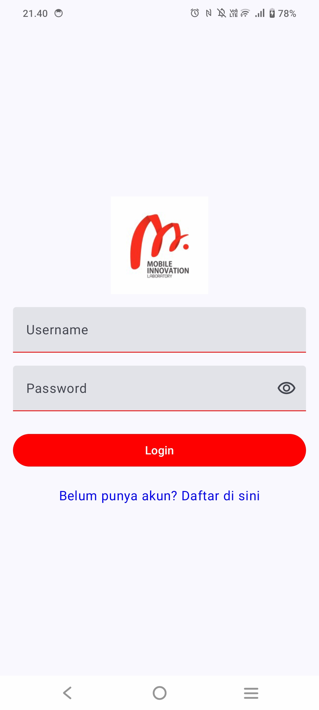
     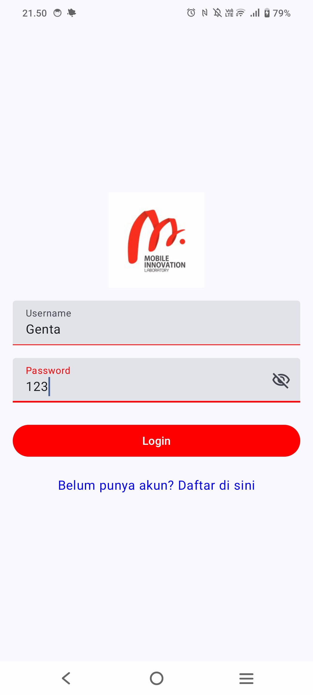
     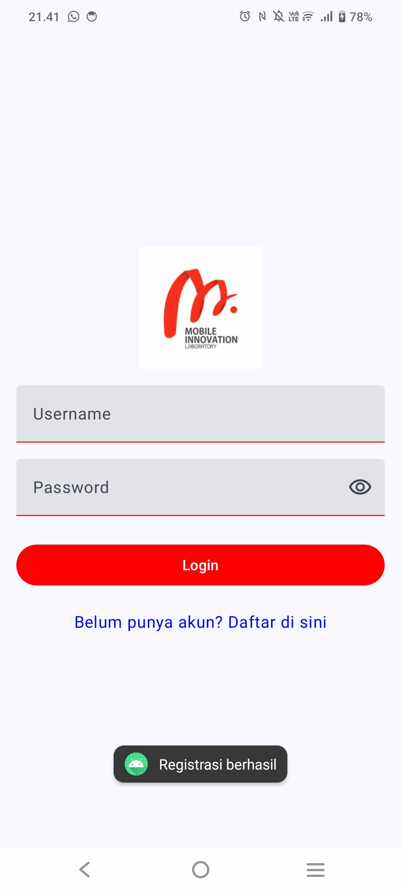
   </div>

### 2. **Register Features**
   - Before entering the application and logging in, users must register an account to enter the user page.
   <div style="display: flex;">
     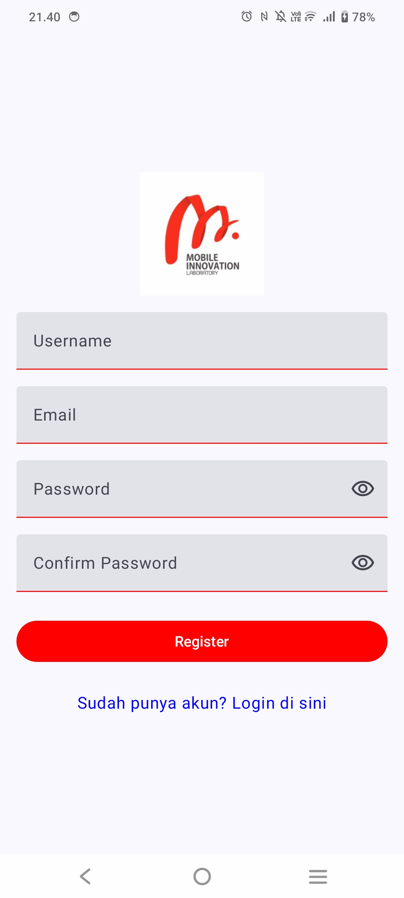
     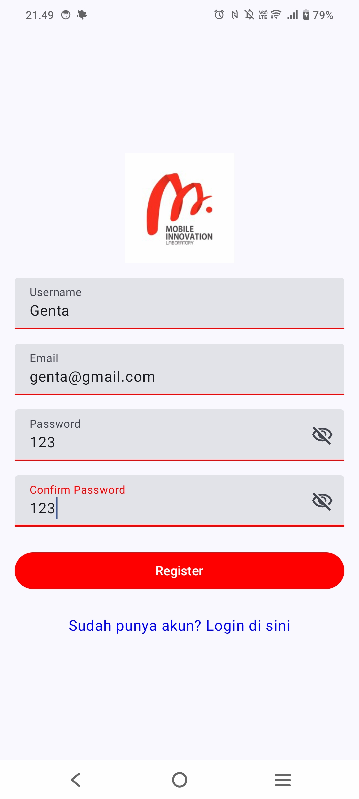
     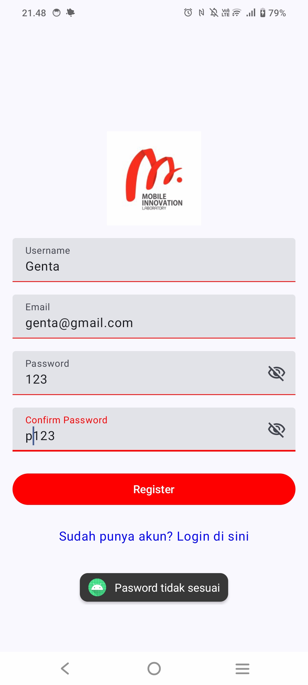
   </div>   

### 3. **Welcoming Home (Home Page)**
   - In this home UI, I designed it to be similar to the UI of most online learning classes.
   <div style="display: flex;">
     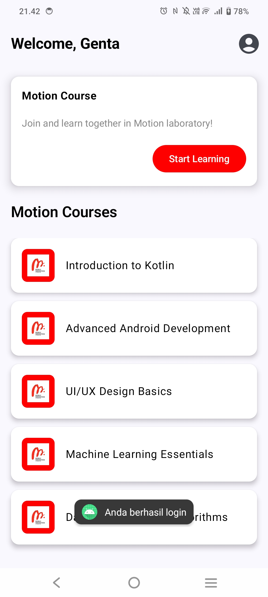
     
     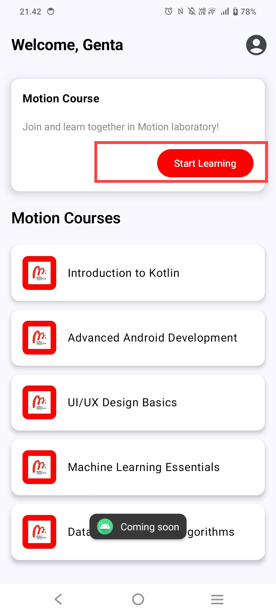
   </div> 

### 4. **Profile Status (Profile Page)**
   - Here users can see their profile status (dummy data). And there is a logout button for users who want to change accounts.
   - and then it will return to the login page
   <div style="display: flex;">
     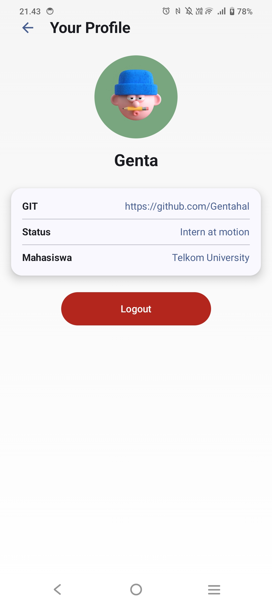
     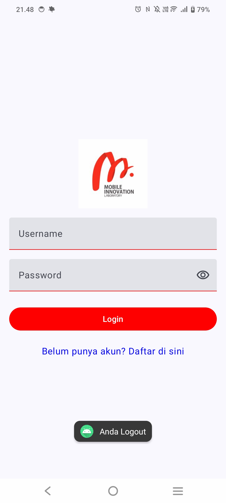
   </div>

### 5. **Notes Screen (add & delete notes)**
   - In this feature, users can create/save notes, and also delete their notes.
   <div style="display: flex;">
     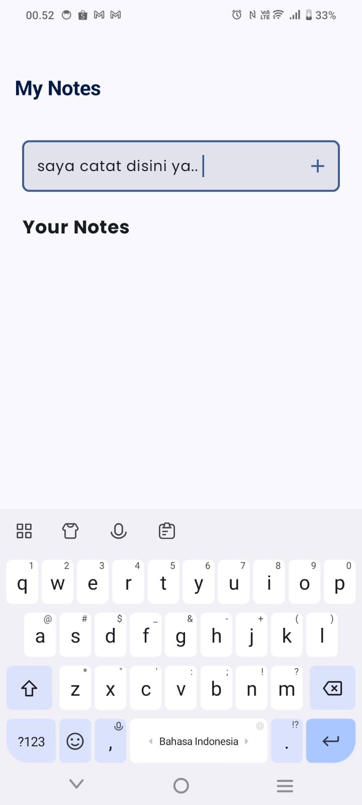
     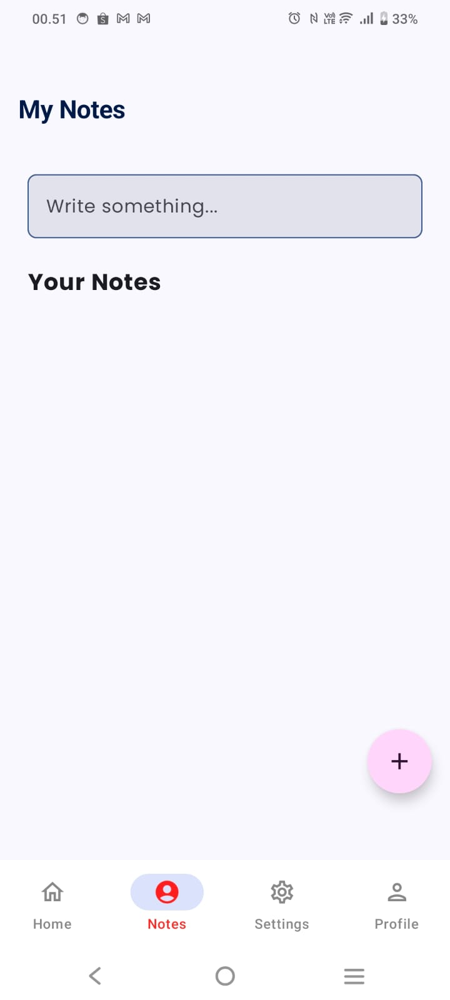
     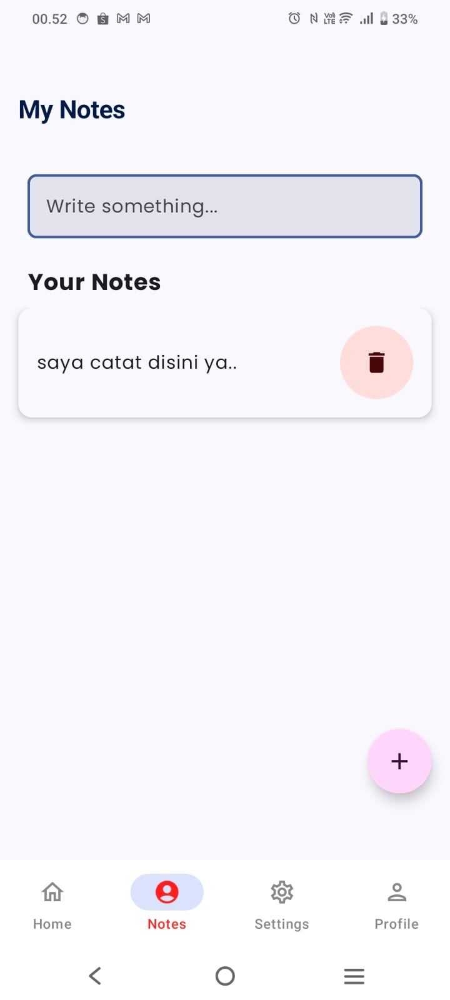
   </div>  

### 6. **Cat Fact (screen)**
   - Here, users can see data about facts about cats that are taken from the API..
   <div style="display: flex;">
     
     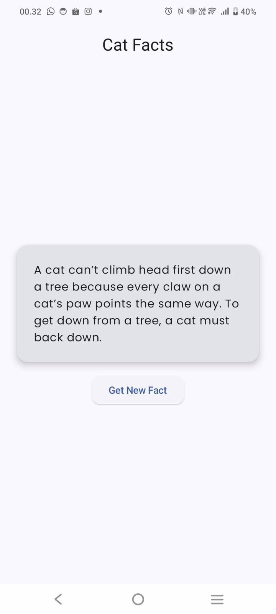
     
     
   </div> 

### 6. **Weather (screen)**
   - Here, implement the feature roomDB using weather API
   <div style="display: flex;">
     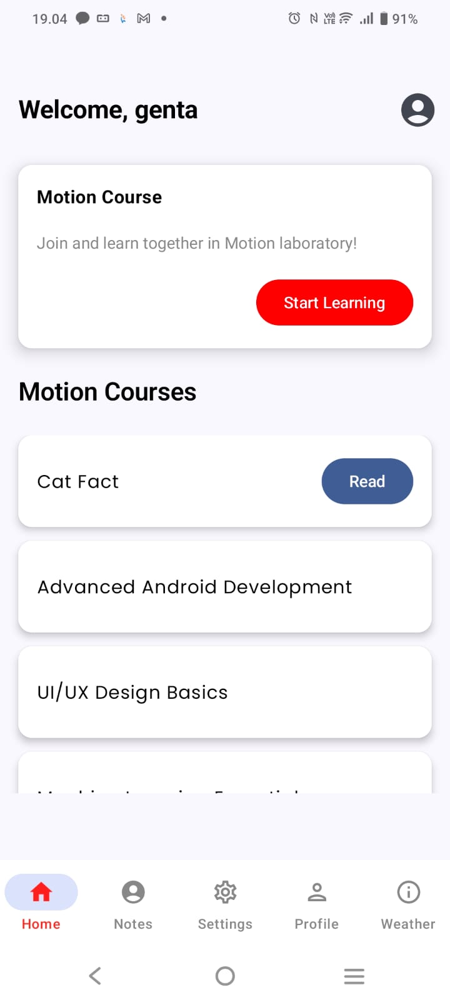
     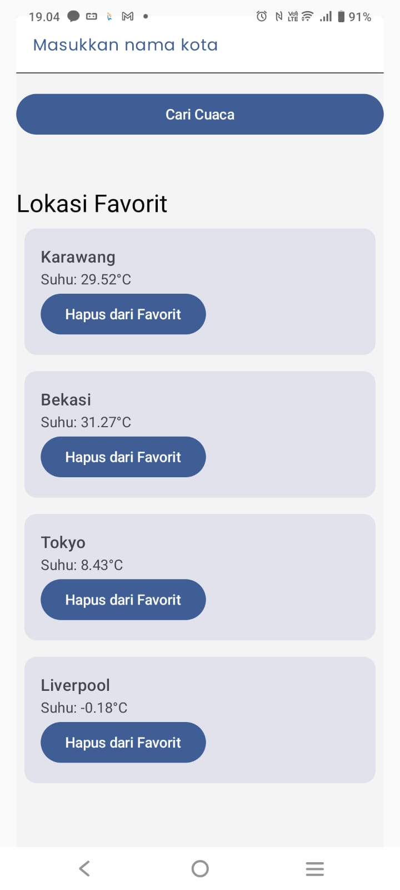
     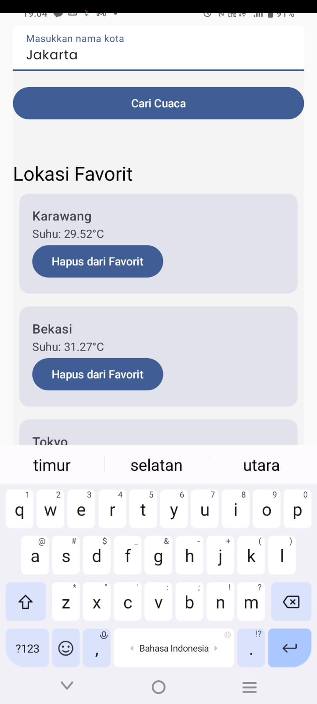
     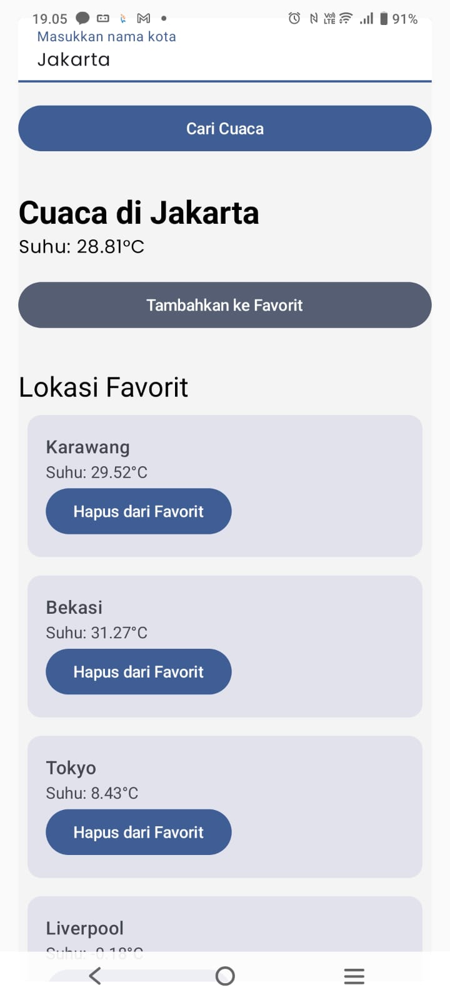
     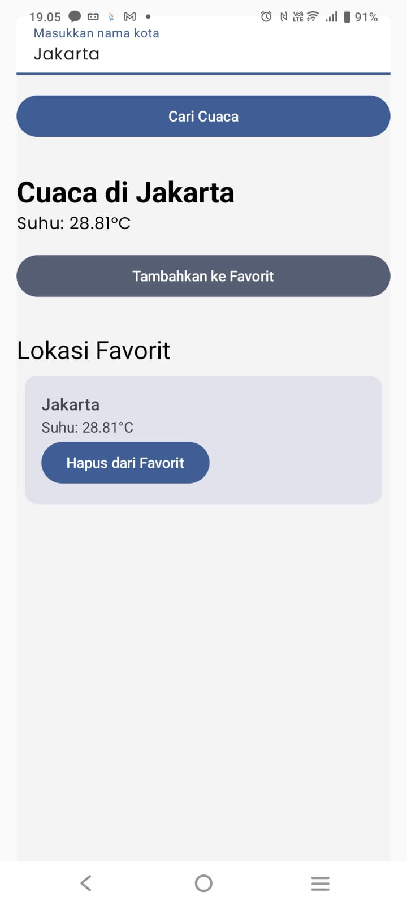
   </div>
   

## 📌 Conclusion
This task provides an understanding of how to store and manage data locally in an Android application using **Room Database**. Completing this task will enhance your knowledge of local database operations in Android.

---
🚀 **Enjoy with my Code!** 🚀

