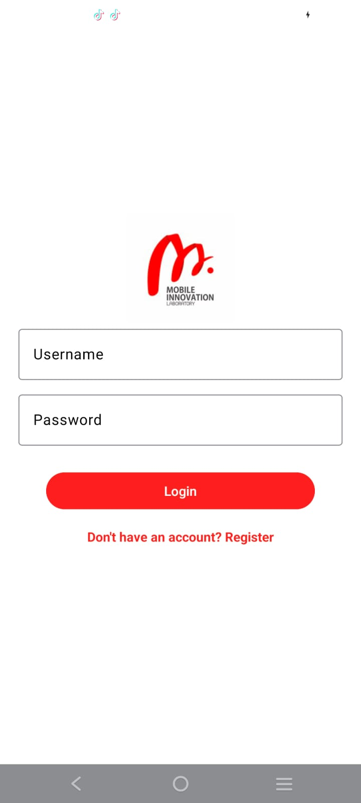
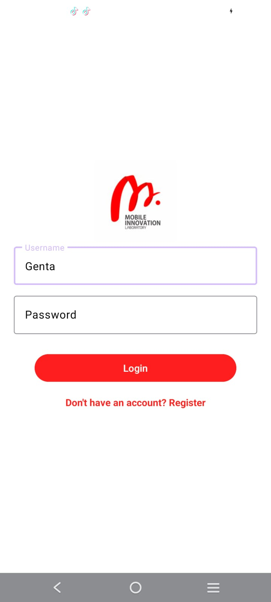
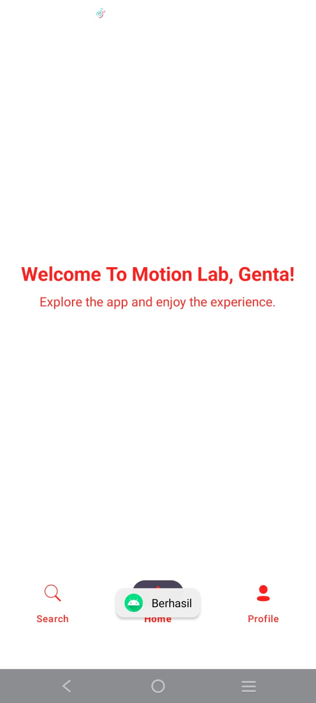
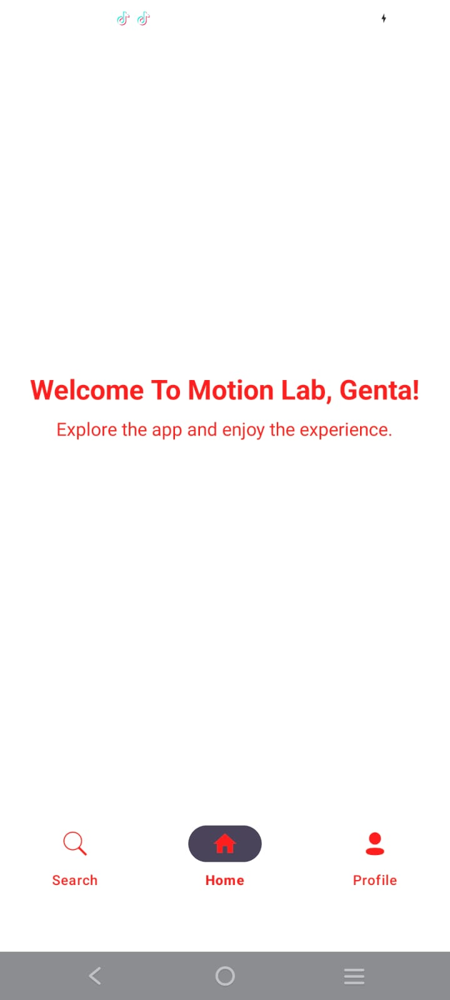
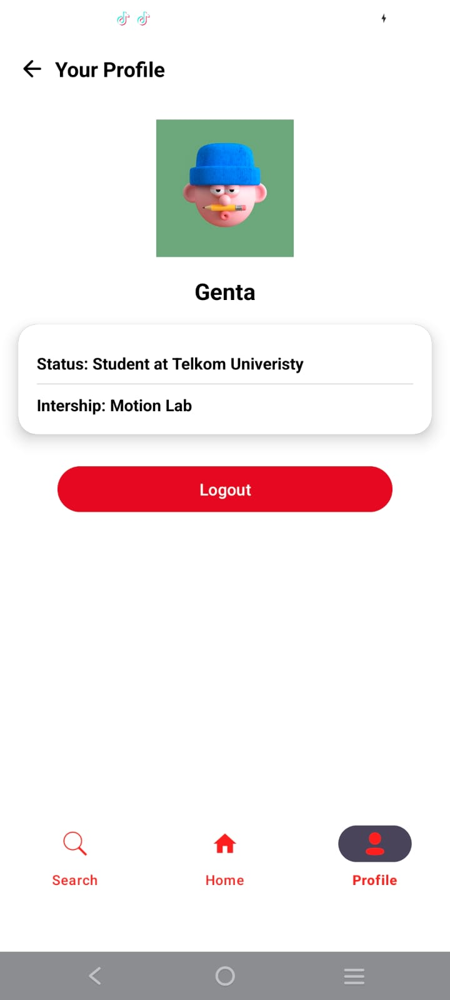
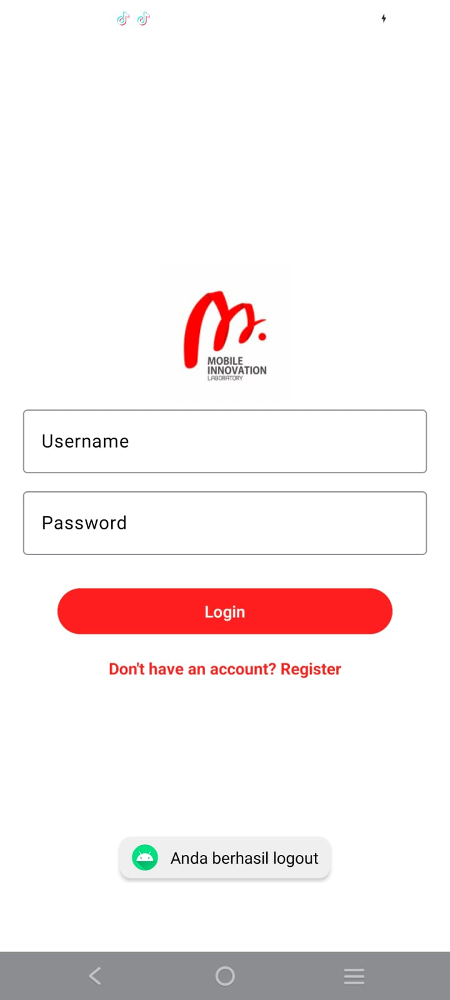
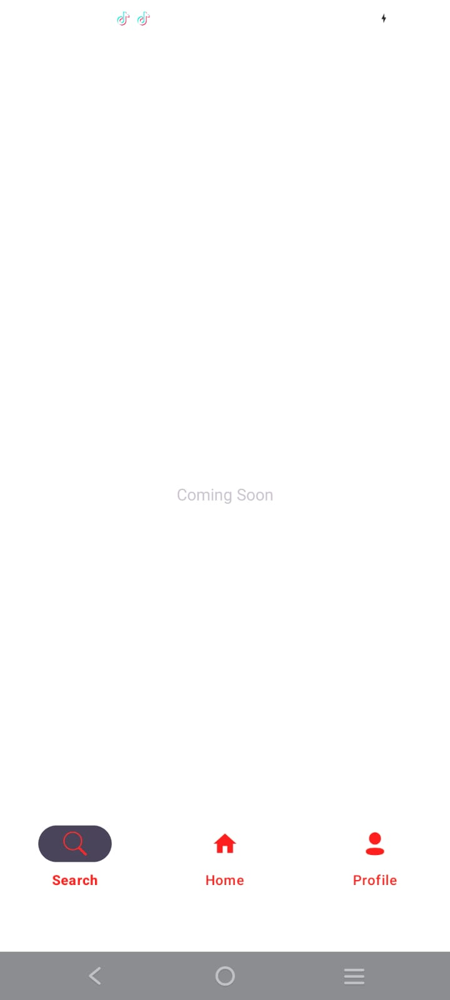

# Layouting with Jetpack Compose

Here I create a simple application with login, register, home, and profile features. The application UI that I made is like an online learning UI.

## Feature

### 1. **Login Pengguna**
   - Users can login with their desired username.
   <div style="display: flex;">
     
     
   </div>

### 2. **Welcoming Home (Home Page)**
   <div style="display: flex;">
     
     
   </div> 

### 3. **Profile Status (Profile Page)**
   - Here users can see their profile status (dummy data). And there is a logout button for users who want to change accounts.
   - and then it will return to the login page
   <div style="display: flex;">
     
     
   </div>

### 4. **Seacrh Page (Coming soon)**
   <div style="display: flex;">
     
   </div>

## Technology Used
- **Kotlin** 
- **XML 5** 
- **Intent**

## Instalation
1. Clone this repository:

   ```bash
   https://github.com/Gentahal/StudyGroup-MP-Motionlab.git

2. Open the project in Android Studio

  - Open Android Studio.
  - Click on Open an existing Android Studio project.
  - Navigate to the project directory and select it to open.

3. Sync Gradle
  - Once the project is opened in Android Studio, you’ll need to sync the project with Gradle. This will download any dependencies specified in the project.
  - Click on File > Sync Project with Gradle Files.

4. Configure Android Emulator or Connect a Device
  - Using an Emulator:
  - In Android Studio, click on the AVD Manager (Android Virtual Device) icon.
  - Create a new virtual device or use an existing one.
  - Choose a device specification (such as Pixel 4) and a system image.
  - Click Start to launch the emulator.
  - Using a Physical Device:
  - Enable Developer Options and USB Debugging on your Android device.
  - Connect your device via USB.
  - Confirm any prompts on your device to allow debugging.
5. Build the Project
  - Ensure there are no errors in the project by building it. You can build the project by clicking on Build > Make Project.

6. Run the Application
- Once everything is set up, you can run the app either on an emulator or a physical device:
- Click the Run button (green triangle) in the Android Studio toolbar.
- Select the device/emulator you want to run the app on.
- The app should now build and run on your selected device.

